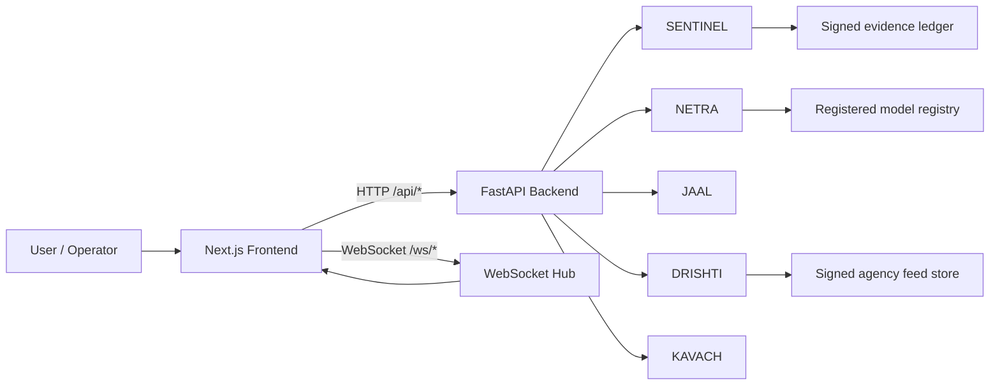

# RAKSHA AI

> AI-powered digital public safety intelligence platform for scam disruption, counterfeit currency detection, fraud-network mapping, geospatial intelligence, and citizen protection.

Built for the **ET AI Hackathon 2.0** by converging five operational modules into one command-centre experience:

- **SENTINEL** for scam and threat-intent intelligence
- **NETRA** for counterfeit currency verification
- **JAAL** for fraud network graph analysis
- **DRISHTI** for geospatial crime intelligence
- **KAVACH** for citizen-facing fraud protection

---

## Table Of Contents

- [What This Project Solves](#what-this-project-solves)
- [Platform At A Glance](#platform-at-a-glance)
- [System Architecture](#system-architecture)
- [Repository Layout](#repository-layout)
- [Getting Started](#getting-started)
- [Environment Variables](#environment-variables)
- [API Reference](#api-reference)
- [Data Contracts](#data-contracts)
- [Chrome Extension](#chrome-extension)
- [Production Notes](#production-notes)
- [Roadmap](#roadmap)
- [Hackathon Context](#hackathon-context)

---

## What This Project Solves

India’s cybercrime landscape is no longer just opportunistic fraud. It now includes organised digital arrest scams, counterfeit-currency circulation, coordinated mule/account networks, and multi-channel deception campaigns built on spoofed identities, fake portals, and social engineering.

RAKSHA AI is designed to shift teams from **reactive case review** to **proactive threat intelligence**:

- detect scam language and caller risk before a victim is fully manipulated
- inspect banknote imagery for counterfeit indicators and trained-model verdicts
- map connected fraud entities into network graphs for investigation
- ingest live, signed partner signals from telecom, payment, banking, and agency sources
- preserve evidence chains and audit trails for review and downstream action

The goal is simple: surface risk early, explain it clearly, and keep evidence usable.

---

## Platform At A Glance

```text
┌──────────────────────────────────────────────────────────────────────┐
│                           RAKSHA AI PLATFORM                         │
│                                                                      │
│  SENTINEL  │   NETRA   │    JAAL    │   DRISHTI   │   KAVACH        │
│  Scams     │ Currency  │  Networks  │ Geospatial  │ Citizen Shield  │
│                                                                      │
│                 Unified Dashboard + Real-time WebSocket Feed         │
└──────────────────────────────────────────────────────────────────────┘
```

| Module | Role | Primary Output |
|---|---|---|
| SENTINEL | Scam-language and threat-intent intelligence | Threat score, verdict, intents, alerts, live partner fusion |
| NETRA | Currency authenticity analysis | AUTHENTIC / SUSPICIOUS / COUNTERFEIT with security-feature breakdown |
| JAAL | Fraud-network graph intelligence | Communities, nodes, edges, risk propagation |
| DRISHTI | Crime geospatial intelligence | Hotspots, heatmap weights, feed ingest status |
| KAVACH | Citizen protection assistant | Safety guidance, helpline cues, number checks, intent routing |
| Dashboard | Cross-module command centre | Combined stats, alert feed, live operational view |

---

## System Architecture



### Frontend layer

The frontend is built with Next.js 15, React 19, TypeScript, Tailwind CSS, and a component system that supports dashboard layouts, module pages, and live data rendering. During development, Next.js proxies `/api/*` and `/ws/*` to the backend so the browser can talk to one origin.

### Backend layer

The backend is a FastAPI application that exposes REST endpoints under `/api/v1/*` plus WebSocket channels under `/ws/*`. Business logic is separated into services so each module can evolve independently.

### Data and evidence layer

Several services persist operational state in SQLite or Supabase, while the live-intelligence path adds signed evidence records and deduplicated feed ingestion so the system can explain how a signal was produced.

### Model registry layer

NETRA includes a release-gated registered-model flow. The backend will only use a model when its card, artifact hash, and validation thresholds are present and valid.

### NETRA CNN model

The repository includes a research-only CNN-based NETRA model exported as `active_model.keras` with its matching `active_model_card.json` inside `backend/data/netra/models/`.

That model was trained from the Colab notebook in [`notebooks/NETRA_FICN_Training_Colab.ipynb`](notebooks/NETRA_FICN_Training_Colab.ipynb) on the Kaggle dataset [preetrank/indian-currency-real-vs-fake-notes-dataset](https://www.kaggle.com/datasets/preetrank/indian-currency-real-vs-fake-notes-dataset), which is listed there as CC BY-NC-SA 4.0 research data.

In the current backend, NETRA uses this registered CNN as an additional release-gated signal alongside the CV/OCR feature pipeline. The model is only accepted when the model card, SHA-256 hash, and validation thresholds all pass the registry checks.

---

## Repository Layout

```text
ET-AI-Hack/
├── frontend/
│   ├── src/
│   │   ├── app/                         # Pages, routes, and app shell
│   │   ├── components/                  # UI building blocks and layouts
│   │   ├── hooks/                       # Client-side hooks
│   │   ├── lib/                         # API clients and helpers
│   │   └── types/                       # Shared TypeScript types
│   ├── next.config.ts                   # Proxy rewrites and image config
│   ├── tailwind.config.ts               # Tailwind theme setup
│   ├── postcss.config.mjs
│   ├── tsconfig.json
│   └── package.json
│
├── backend/
│   ├── app/
│   │   ├── main.py                      # FastAPI app, middleware, routes, WebSockets
│   │   ├── config.py                    # pydantic-settings config from .env
│   │   ├── models/
│   │   │   └── schemas.py               # Pydantic request/response models
│   │   ├── routes/                      # API route handlers per module
│   │   ├── services/                    # Core business logic
│   │   └── websockets/                  # WebSocket manager and handlers
│   ├── app/data/
│   │   ├── scam_corpus.json             # SENTINEL corpus
│   │   ├── kavach_docs/                 # Citizen guidance content
│   │   ├── netra_datasets/              # NETRA dataset contract and docs
│   │   └── scenarios/                   # Scenario inputs and fixtures
│   ├── data/
│   │   └── netra/models/                # Registered NETRA CNN model card + artifact (active_model.keras + active_model_card.json)
│   ├── data_runtime/                    # Runtime DBs, keys, and ledger files
│   ├── scripts/                         # Utility scripts
│   ├── supabase/                        # SQL schemas for persistent stores
│   ├── tests/                           # Backend test coverage
│   ├── run.py                           # Backend launcher
│   ├── requirements.txt                 # Python dependencies
│   └── .env                             # Local secrets and configuration
│
├── chrome-extension/                    # Manifest V3 companion extension
├── docs/                                # Architecture and evaluation docs
├── context/                             # Competition brief and planning inputs
├── feature_plans/                       # Feature-specific planning notes
├── notebooks/                           # Training/export notebooks, including NETRA_FICN_Training_Colab.ipynb for the CNN model
├── whatsapp-bridge/                     # Node bridge for WhatsApp integration
└── README.md
```

### Key backend paths

- `backend/app/services/sentinel_service.py` handles core scam scoring.
- `backend/app/services/sentinel_intelligence.py` handles signed live partner events.
- `backend/app/services/netra_service.py` runs the multi-stage currency pipeline.
- `backend/app/services/netra_model_service.py` handles the registered NETRA model card and artifact.
- `backend/data/netra/models/active_model.keras` is the bundled CNN artifact exported by the training notebook.
- `backend/data/netra/models/active_model_card.json` stores the release metadata, validation metrics, and artifact hash.
- `backend/app/services/agency_feed_service.py` ingests signed agency feeds.
- `backend/app/services/evidence_ledger.py` stores the signed evidence chain.

---

## Getting Started

### Prerequisites

- Node.js 18 or newer
- Python 3.11 or newer
- npm
- Git

### 1. Clone the repository

```bash
git clone https://github.com/<your-username>/ET_AI_Hack.git
cd ET_AI_Hack
```

### 2. Backend setup

```bash
cd backend
python -m venv .venv
```

Activate the environment:

```bash
# Windows
.venv\Scripts\activate

# macOS / Linux
source .venv/bin/activate
```

Install backend dependencies:

```bash
pip install -r requirements.txt
```

Copy the environment template if needed:

```bash
copy .env.example .env
```

Start the backend:

```bash
python run.py
```

Or run uvicorn directly:

```bash
uvicorn app.main:app --reload --port 8000
```

Useful backend URLs:

- API base: `http://localhost:8000`
- Swagger UI: `http://localhost:8000/docs`
- ReDoc: `http://localhost:8000/redoc`

### 3. Frontend setup

```bash
cd frontend
npm install
```

Create `frontend/.env.local`:

```env
NEXT_PUBLIC_API_URL=http://localhost:8000
```

Start the frontend:

```bash
npm run dev
```

Useful frontend URL:

- App: `http://localhost:3000`

During development, the frontend proxies `/api/*` and `/ws/*` to the backend automatically, so you usually do not need extra CORS tweaking beyond the defaults already in `backend/.env`.

### 4. Optional Chrome extension

The companion extension lives in [`chrome-extension/`](chrome-extension/). It provides portal shortcuts and optional voice control for the configured RAKSHA experience. Its own setup and packaging instructions are documented in [`chrome-extension/README.md`](chrome-extension/README.md).

### 5. Verify the stack

```bash
# Backend health
curl http://localhost:8000/health

# Dashboard summary
curl http://localhost:8000/api/v1/dashboard/stats

# SENTINEL text analysis
curl -X POST http://localhost:8000/api/v1/sentinel/analyse/text \
  -H "Content-Type: application/json" \
  -d '{"text":"This is CBI. Your account has been frozen due to money laundering."}'
```

---

## Environment Variables

### Backend `.env`

The backend reads [`backend/.env`](backend/.env) through `pydantic-settings`.

#### Runtime and UI

| Variable | Purpose | Notes |
|---|---|---|
| `FASTAPI_DEBUG` | Enables debug mode | Keep `true` locally, `false` in production |
| `FASTAPI_SECRET_KEY` | App secret | Replace with a strong random value for production |
| `BACKEND_HOST` | Bind address | Usually `0.0.0.0` |
| `BACKEND_PORT` | Listen port | Usually `8000` |
| `CORS_ORIGINS` | Allowed origins | Comma-separated list |
| `FRONTEND_DEV_URL` | Frontend origin | Used for local development assumptions |

#### Supabase and data stores

| Variable | Purpose |
|---|---|
| `SUPABASE_URL` | Supabase project URL |
| `SUPABASE_ANON_KEY` | Public anon key for client-safe uses |
| `SUPABASE_SERVICE_ROLE_KEY` | Service-role key for privileged server operations |
| `SUPABASE_SERVICE_KEY` | Alternate service-key name supported by the config |
| `DATABASE_URL` | PostgreSQL connection string if used by related components |

#### SENTINEL and messaging

| Variable | Purpose |
|---|---|
| `GROQ_API_KEY` | Groq LLM access |
| `GROQ_MODEL` | Model name |
| `NUMVERIFY_API_KEY` | Phone lookup service |
| `AUTHKEY_API_KEY` | SMS/voice alert delivery |
| `AUTHKEY_SENDER_ID` | Sender label |
| `AUTHKEY_COUNTRY_CODE` | Default country code |
| `WHATSAPP_BRIDGE_URL` | Node-sidecar bridge URL |

#### Live intelligence and evidence

| Variable | Purpose | Notes |
|---|---|---|
| `INTEGRATION_HMAC_SECRET` | Shared secret for signed partner webhooks | Generate a long random secret |
| `INTEGRATION_REQUIRE_SIGNATURE` | Enforce signatures for live partner events | Set `true` outside local dev |
| `INTEGRATION_MAX_EVENT_AGE_SECONDS` | Replay window | Default `300` |
| `EVIDENCE_LEDGER_PATH` | Ledger DB path | File path, not a secret |
| `EVIDENCE_PACKAGE_DB_PATH` | Evidence package DB path | File path, not a secret |
| `EVIDENCE_SIGNING_PRIVATE_KEY_PATH` | Private key file path | Auto-created if missing |
| `EVIDENCE_SIGNING_PUBLIC_KEY_PATH` | Public key file path | Shared verifier material |
| `AGENCY_FEED_HMAC_SECRET` | Shared secret for agency feeds | Generate a different long random secret |
| `AGENCY_FEED_REQUIRE_SIGNATURE` | Enforce signed agency feeds | Set `true` in production |
| `AGENCY_FEED_MAX_EVENT_AGE_SECONDS` | Replay window | Default `300` |
| `AGENCY_FEED_DB_PATH` | Agency feed DB path | File path, not a secret |

#### NETRA registry

| Variable | Purpose | Notes |
|---|---|---|
| `NETRA_MODEL_DIR` | Registered model directory | Default `data/netra/models` |
| `NETRA_DATASET_DIR` | Training/evaluation dataset root | Must contain dataset folders with `manifest.jsonl` |
| `NETRA_MIN_VALIDATION_ACCURACY` | Release gate | Accuracy threshold |
| `NETRA_MAX_FALSE_POSITIVE_RATE` | Release gate | False-positive threshold |

The bundled CNN model in `NETRA_MODEL_DIR` is tied to the Kaggle research dataset mentioned above. If you retrain it, keep the artifact card and hash in sync with the new file so the registry continues to accept it.

### Frontend `.env.local`

| Variable | Purpose |
|---|---|
| `NEXT_PUBLIC_API_URL` | Backend base URL, usually `http://localhost:8000` |

---

## API Reference

Every endpoint returns the same response envelope:

```json
{
  "success": true,
  "data": {},
  "error": null,
  "meta": {}
}
```

### Health

| Method | Endpoint | Description |
|---|---|---|
| GET | `/health` | Service health check |

### Dashboard

| Method | Endpoint | Description |
|---|---|---|
| GET | `/api/v1/dashboard/stats` | Combined platform metrics |
| GET | `/api/v1/dashboard/alerts` | Cross-module alert feed |

### SENTINEL

| Method | Endpoint | Description |
|---|---|---|
| POST | `/api/v1/sentinel/analyse/text` | Score text for scam intent and threat level |
| GET | `/api/v1/sentinel/number/{phone}` | Return risk information for a phone number |
| GET | `/api/v1/sentinel/alerts` | List active SENTINEL alerts |
| POST | `/api/v1/sentinel/ingest/live` | Ingest authorised live intelligence events |

### NETRA

| Method | Endpoint | Description |
|---|---|---|
| POST | `/api/v1/netra/scan` | Upload a currency image for analysis |
| POST | `/api/v1/netra/scan/batch` | Scan multiple images in one request |
| GET | `/api/v1/netra/scan/{scan_id}` | Fetch a previous scan result |
| GET | `/api/v1/netra/serial/{number}` | Validate a serial number |
| GET | `/api/v1/netra/stats` | Aggregate NETRA scan statistics |
| POST | `/api/v1/netra/report` | Report a counterfeit note for follow-up |
| GET | `/api/v1/netra/history` | Recent scan history |
| GET | `/api/v1/netra/model/status` | Registered model readiness and card status |
| POST | `/api/v1/netra/model/train` | Train a registered model from an approved dataset |
| POST | `/api/v1/netra/model/evaluate` | Evaluate a registered dataset |

### JAAL

| Method | Endpoint | Description |
|---|---|---|
| GET | `/api/v1/jaal/communities` | Fraud-ring communities |
| GET | `/api/v1/jaal/graph/{cluster_id}` | Full graph for a specific cluster |

### DRISHTI

| Method | Endpoint | Description |
|---|---|---|
| GET | `/api/v1/drishti/hotspots` | Geotagged hotspot incidents |
| GET | `/api/v1/drishti/heatmap` | Heatmap-friendly lat/lng/weight data |

### KAVACH

| Method | Endpoint | Description |
|---|---|---|
| POST | `/api/v1/kavach/chat` | Citizen chat assistant and safety guidance |
| POST | `/api/v1/kavach/check/number` | Fast number-risk check |

### WebSockets

| Channel | Endpoint | Purpose |
|---|---|---|
| Generic module feed | `/ws/{module}` | Broadcast messages to a module channel |
| SENTINEL stream | `/ws/sentinel/stream` | Live scam-intelligence stream |
| WhatsApp relay | `/ws/whatsapp` | Bridge WhatsApp events to the frontend |

On connect, the server sends:

```json
{ "event": "connected", "module": "sentinel" }
```

Messages received by a channel are broadcast to all subscribers on that channel.

---

## Data Contracts

### Standard API response

```ts
interface ApiResponse<T> {
  success: boolean;
  data: T;
  error: string | null;
  meta: Record<string, unknown>;
}
```

### Dashboard summary

```ts
interface DashboardStats {
  activeAlerts: number;
  scamsDetectedToday: number;
  counterfeitFound: number;
  citizensProtected: number;
}
```

### SENTINEL result

```ts
interface SentinelAnalysisResult {
  threat_score: number;
  verdict: "SCAM" | "SUSPICIOUS" | "SAFE";
  intents: string[];
  confidence: number;
}
```

### NETRA result

```ts
interface NetraScanResult {
  verdict: "AUTHENTIC" | "SUSPICIOUS" | "COUNTERFEIT";
  confidence: number;
  denomination: string;
  features: Array<{
    name: string;
    status: "pass" | "fail" | "warn";
  }>;
}
```

### JAAL graph

```ts
interface GraphNode {
  id: string;
  label: string;
  type: string;
  riskScore: number;
}

interface GraphEdge {
  id: string;
  source: string;
  target: string;
  type: string;
  weight: number;
}
```

### DRISHTI hotspot

```ts
interface HotspotData {
  id: string;
  lat: number;
  lng: number;
  intensity: number;
  type: string;
  district: string;
}
```

### KAVACH response

```ts
interface KavachChatResponse {
  reply: string;
  intents: string[];
  quickActions: string[];
  riskLevel: "danger" | "warning" | "safe";
}
```

---

## Chrome Extension

The repository includes a deployable Manifest V3 companion in [`chrome-extension/`](chrome-extension/). It is designed to extend the portal experience with shortcuts and optional voice-driven navigation.

If you want to package or validate it, start from the extension’s own README and scripts in that folder.

---

## Production Notes

This repository includes local-development defaults, but production deployments should tighten the following:

1. Set `FASTAPI_DEBUG=false`.
2. Replace `FASTAPI_SECRET_KEY` with a strong random value.
3. Use real shared secrets for `INTEGRATION_HMAC_SECRET` and `AGENCY_FEED_HMAC_SECRET`.
4. Set `INTEGRATION_REQUIRE_SIGNATURE=true` and `AGENCY_FEED_REQUIRE_SIGNATURE=true` outside local demo mode.
5. Keep `NETRA_MODEL_DIR` pointed at a valid registered-model folder with a matching card and artifact hash.
6. Provide a real dataset tree under `NETRA_DATASET_DIR` only when you intend to train or evaluate models.
7. Run the backend behind a reverse proxy and a TLS-terminated deployment target.
8. Store secrets outside version control wherever possible.

The evidence ledger creates its own Ed25519 keypair files if they do not already exist, so those paths are runtime files rather than manual secrets.

---

## Roadmap

| Module | Current baseline | Next target |
|---|---|---|
| SENTINEL | Rule-based scoring plus live signed partner fusion | More robust multilingual scam classification and source-specific feeds |
| NETRA | Transparent registered-model flow with release gates | Stronger vetted CNN and localisation model on authorised FICN data |
| JAAL | Seed graph + evidence-backed ingestion | Graph neural network over live financial and call metadata |
| DRISHTI | Geospatial baseline with signed feed ingest | Production agency feeds and patrol optimisation |
| KAVACH | Rule-based assistant | Richer multilingual assistant with broader intent coverage |
| WebSockets | In-process broadcast registry | Distributed pub/sub event bus |

---

## Hackathon Context

**ET AI Hackathon 2.0** — Economic Times × Unstop  
Theme: Smart Cities / Public Safety / Digital Trust / Geospatial Law Enforcement

### Problem statement

Build an AI-powered digital public safety intelligence platform that equips law enforcement agencies, financial institutions, and citizens with proactive tools to detect, disrupt, and respond to digital fraud networks, counterfeit currency circulation, and organised scam operations.

### Why this matters

- reduce time-to-detection before victimisation spreads
- expose network relationships instead of isolated incidents
- preserve auditability and evidence integrity
- provide citizens a usable first-response safety layer

### Evaluation focus

- detection accuracy
- precision and recall
- false-positive rate
- lead time before victimisation
- auditability of intelligence packages for legal admissibility


