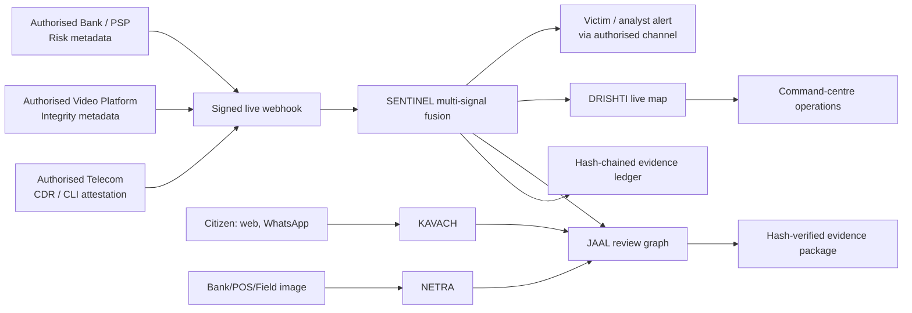

# RAKSHA AI architecture

Trust boundary: all third-party feeds enter through a signed, timestamped,
privacy-minimised contract. The evaluator and the command centre expose the
evidence basis for a risk assessment. Automated classification creates a lead;
an investigator validates evidence before a restrictive action.
